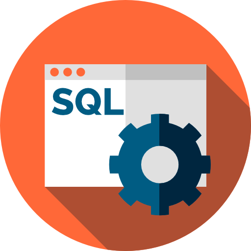

[][fem]

  Learn to construct databases, write queries, and optimize SQL with industry veteran Brian Holt.

## License

The **code** in this repo is licensed under the Apache 2.0 license.

The **content** is licensed under CC-BY-NC-4.0.

[fem]: https://frontendmasters.com/workshops/complete-intro-sql/

## Course Icon License

<a href="https://www.flaticon.com/free-icons/sql-server" title="sql server icons">SQL icons created by juicy_fish - Flaticon</a>
